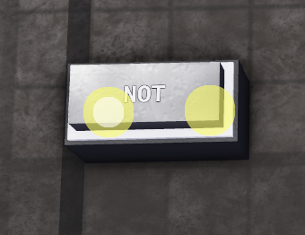

# NOT Gate

**Category:** OE Logic > Gates

**Description:** Returns true when input is false, and vice versa.

**Input types:**  
- boolean  

**Output types:**  
- boolean

**Simulation:**  

| Input 1 | Output |
|---------|--------|
| 0       | 1      |
| 1       | 0      |
