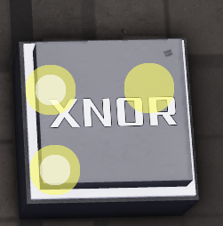

# XNOR Gate

**Category:** OE Logic > Gates

**Description:** Returns true if both inputs are the same.

**Input types:**  
- boolean  

**Output types:**  
- boolean

**Simulation:**  

| Input 1 | Input 2 | Output |
|---------|---------|--------|
| 0       | 0       | 1      |
| 0       | 1       | 0      |
| 1       | 0       | 0      |
| 1       | 1       | 1      |

Logically equivalent to a XOR gate with a NOT after it.
