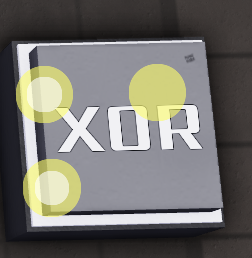

# XOR Gate

**Category:** OE Logic > Gates

**Description:** Returns true only if one input is true
**Input types:**  
- boolean  

**Output types:**  
- boolean

**Simulation:**  

| Input 1 | Input 2 | Output |
|---------|---------|--------|
| 0       | 0       | 0      |
| 0       | 1       | 1      |
| 1       | 0       | 1      |
| 1       | 1       | 0      |
