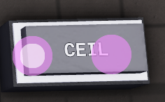

# CEIL (Ceiling)

**Category:** OE Logic > Math  

**Description:** Rounds input numbers up.  

**Input types:**  
- number  
- vector (both inputs must be the same type)  

**Output types:**  
- number  
- vector (same type as inputs)  

**Examples:**  
- `-5.43 → -5`  
- `3.5 → 4`  
- `(10.4, -20.6, 13.5) → (11, -20, 14)`
