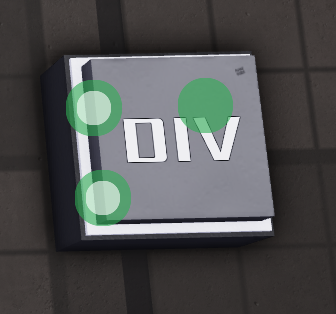

# DIV (Division)

**Category:** OE Logic > Math  

**Description:** Divides the first value by the second.  

**Input types:**  
- number  
- vector (both inputs must be the same type)  

**Output types:**  
- number  
- vector (same type as inputs)  

**Examples:**  
- `-5/3 = 1.667`  
- `10/2 = 5`  
- `8/0 = UNDEFINED`  
- `(10, 20, 13) + (5, -3, 7) = (2, -6.667, 1.857)`

**Tip:** Dividing by 0 will result in undefined, setting the block on fire.
